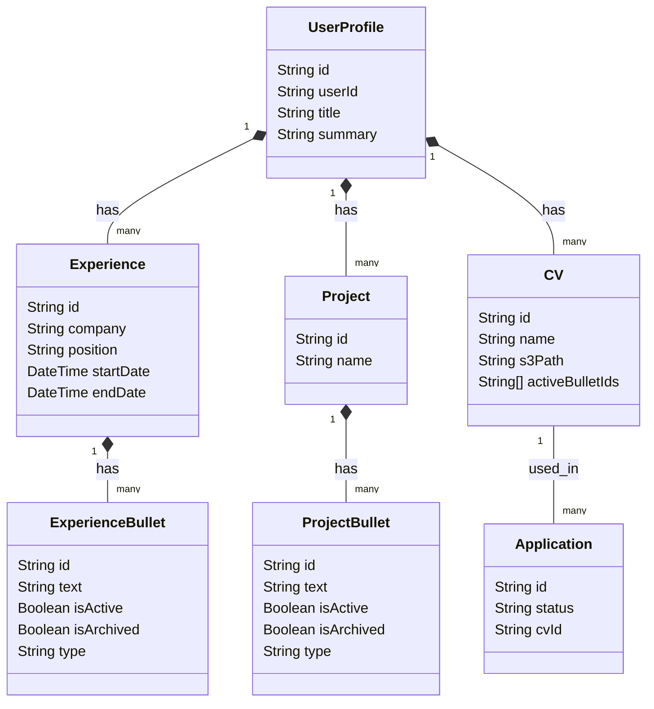

# Implementation Plan: Experience Bullets & CV Version History (Refined)

**Branch**: `001-apply-copilot-system` | **Date**: 2026-05-26  
**Spec**: [spec.md](./spec.md) | **Tasks**: [tasks.md](./tasks.md)

## Summary

To achieve high flexibility, history preservation, and interactive customization of resume versions, we will upgrade the flat `experiences.description` and `projects.bulletPoints` arrays in MongoDB into structured relations (`ExperienceBullet` and `ProjectBullet`).

We will also implement a dedicated `CV` schema to track generated resume versions (saving tailored PDF paths on AWS S3), target applications, and the exact bullet points utilized in each version. 

To ensure that deleting profile bullets does not break historical CV records or job application views, we will enforce a **Soft-Delete/Archiving Pattern**: if a user deletes a bullet that has already been utilized in a generated CV, it will be marked as `isArchived: true` (hidden from the active profile editor) instead of hard-deleted from the database.

---

## Technical Context & Decisions

- **Database**: MongoDB via Prisma.
- **Frontend**: Next.js 16 (App Router), Ant Design 6, Tailwind CSS 4.
- **ORM**: Prisma Client.
- **Zod Validation**: `src/lib/validation/profile.ts`.
- **CV Parsing Consolidation (D1)**: The standard CV parsing defined in **FR-002** is implemented sequentially as described in **FR-002b** (multi-step client-orchestrated parsing) to avoid LLM timeouts and ensure maximum quality.
- **Exact String Matching (A1)**: Deduplication and sequential import merging are performed strictly through **Exact String Match** (case-insensitive, whitespace-trimmed, and punctuation-normalized comparisons) rather than semantical similarity, to keep the merging rules clear and deterministic.
- **Storage Nuance (I1)**: Raw CV PDFs uploaded for parsing are **temporary** and processed in-memory or on local dev storage (with standard automated deletion) without permanent AWS S3 persistence. S3 bucket storage is strictly reserved for the tailored, **generated CV** files linked to actual job applications (the `CV` model).
- **Dynamic Relationship Resolution (I2)**: To avoid complex bidirectional synchronization bugs between bullets and CVs in MongoDB, the bullets (`ExperienceBullet`, `ProjectBullet`) will **not** store an explicit list of `cvIds` in the DB. Instead, the CV connections are **dynamically computed at query-time** on profile `GET` by fetching all `CV` models for the user, checking which ones include the bullet's ID in their `activeBulletIds` list, and returning this count/name list to the frontend.

---

## Proposed Changes

### Database & Backend

#### [MODIFY] [Prisma Schema](file:///Users/wagnertaiatella/repos/applyCopilot/frontend/prisma/schema.prisma)
- Replace `description String[]` in `Experience` model with `description ExperienceBullet[]`.
- Replace `bulletPoints String[]` in `Project` model with `bulletPoints ProjectBullet[]`.
- Define the new **`ExperienceBullet`** model:
  - `id`: String @id @default(auto()) @map("_id") @db.ObjectId
  - `experienceId`: String @db.ObjectId
  - `text`: String
  - `isActive`: Boolean @default(true)
  - `isArchived`: Boolean @default(false)
  - `type`: String @default("bullet") // "bullet" or "paragraph"
- Define the new **`ProjectBullet`** model:
  - `id`: String @id @default(auto()) @map("_id") @db.ObjectId
  - `projectId`: String @db.ObjectId
  - `text`: String
  - `isActive`: Boolean @default(true)
  - `isArchived`: Boolean @default(false)
  - `type`: String @default("bullet") // "bullet" or "paragraph"
- Define the new **`CV`** model:
  - `id`: String @id @default(auto()) @map("_id") @db.ObjectId
  - `userId`: String @db.ObjectId
  - `name`: String
  - `s3Path`: String?
  - `activeBulletIds`: String[] // Holds both ExperienceBullet & ProjectBullet IDs
  - `createdAt`: DateTime @default(now())
  - `updatedAt`: DateTime @updatedAt
- Update **`Application`** model:
  - Add `cvId String? @db.ObjectId` and relation `cv CV? @relation(fields: [cvId], references: [id])`.
- Update **`User`** model to include `cvs CV[]`.

#### [MODIFY] [Profile API route.ts](file:///Users/wagnertaiatella/repos/applyCopilot/frontend/src/app/api/profile/route.ts)
- Update `GET` endpoint to include:
  - `experiences.description` (ordered by active, unarchived, then creation).
  - `projects.bulletPoints` (ordered similarly).
  - **Dynamic CV Mapping**: Query all user `CV` versions. For each bullet, scan all loaded CVs' `activeBulletIds` to compile the count badge and a list of parent CV names dynamically, sending this list under a virtual `cvs` field to the frontend.
- Update `POST` endpoint to handle **Sequential Import Merging & Duplication Avoidance** using exact matching:
  - **Experiences Matching & Merging**:
    - For each incoming experience, match it against existing database experiences by normalizing `company` and `position` (case-insensitive, trimmed).
    - If matched:
      - Inherit and preserve the existing database experience's `id`.
      - **Merge bullets**: Match incoming bullets against existing bullets (active or archived) under this experience using **exact text match** (trimmed, case-insensitive). If matched, preserve the existing bullet `id`. If new, insert it as a brand new `ExperienceBullet` record.
      - **Superset Preservation**: Do not delete existing unmatched bullets during an import merge (keep them active/preserved).
    - If not matched: Create a brand new `Experience` and its respective `ExperienceBullet` records.
  - **Projects Matching & Merging**:
    - Replicate the exact same deduplication strategy for `projects` (matching by normalized `name`).
    - Merge project bullets using exact match to preserve existing database bullet IDs and prevent duplication.
  - **Education & Skills Matching**:
    - Match incoming education by `institution` and `degree/field` to reuse existing database IDs.
    - Match incoming skills by `name` (case-insensitive) to reuse existing skills.
  - **Soft-Delete Archiving Logic**:
    - If a bullet was present in the database but is explicitly deleted by the user in the edit form (sends a request without that bullet's ID):
      - Query if this bullet is present in any CV (`activeBulletIds`).
      - If **YES**: Soft-delete by setting `isArchived: true` to hide it from forms but keep it historically.
      - If **NO**: Safely hard-delete it.

#### [NEW] [Focused Parsing API Endpoints](file:///Users/wagnertaiatella/repos/applyCopilot/frontend/src/app/api/profile/parse/)
We will introduce 4 specific endpoints for focused LLM parsing to maximize assertiveness and prevent timeouts. Each endpoint receives `{ cvText }` (the full resume text context) and returns a specific, typed JSON block:
- **`POST /api/profile/parse/basic`**: Extracts personal contact info (name, email, phone, location, links) and generates a brief summary.
- **`POST /api/profile/parse/experiences`**: Extracts professional experiences list, structured into nested jobs and discrete bullet lists.
- **`POST /api/profile/parse/projects`**: Extracts project history list, structured with name, technologies, and bullet details.
- **`POST /api/profile/parse/education-skills`**: Extracts education history, certifications, and a categorized skills list.

#### [MODIFY] [CV Upload UI & Orchestrator](file:///Users/wagnertaiatella/repos/applyCopilot/frontend/src/components/profile/CVUploader.tsx)
- Re-architect the CV upload pipeline to be client-orchestrated:
  1. **Upload & Extract (20%)**: Client uploads the PDF/DOCX to `/api/profile/upload-cv`, which saves the file and returns the full extracted `cvText`.
  2. **Parse Basic (40%)**: Send `cvText` to `/api/profile/parse/basic` to get basic info.
  3. **Parse Experiences (60%)**: Send `cvText` to `/api/profile/parse/experiences` to get experiences and structured bullets.
  4. **Parse Projects (80%)**: Send `cvText` to `/api/profile/parse/projects` to get projects and structured bullets.
  5. **Parse Education & Skills (90%)**: Send `cvText` to `/api/profile/parse/education-skills` to get education and skills lists.
  6. **Merge & Save (100%)**: Merge all parsed segments with existing profile data (via exact match deduplication logic), POST the combined payload to `/api/profile` to save it to the DB, and notify the user of success.
- Update the progress indicator to reflect real-time active states corresponding to these actual HTTP requests.

---

### Frontend Components

#### [MODIFY] [ExperiencesForm.tsx](file:///Users/wagnertaiatella/repos/applyCopilot/frontend/src/components/profile/ExperiencesForm.tsx)
- Modify the bullet points Form List to handle structured objects:
  - Each item displays:
    - A prefix: if `type === "bullet"`, render a bullet dot (`•`). If `type === "paragraph"`, render an empty space or indentation.
    - A text input/TextArea for bullet `text`.
    - A toggle/checkbox for `isActive`.
    - A dropdown/select or toggle to switch `type` between `"bullet"` and `"paragraph"`.
    - An Ant Design `Tooltip` or `Popover` showing a CV count badge (if `cvs.length > 0`).
      - Clicking/hovering on this badge renders the list of CV names as active links (pointing to the future CV customization route `/cv/[id]`).
  - Update `removeBp` handler to exclude the deleted item from the state, letting the backend handle archiving automatically on save.

#### [MODIFY] [ProjectsForm.tsx](file:///Users/wagnertaiatella/repos/applyCopilot/frontend/src/components/profile/ProjectsForm.tsx)
- Replicate the exact same structured bullet point list, styling, toggles, soft-delete archiving, and CV links count badge inside `ProjectsForm.tsx`.

#### [MODIFY] [ProfilePage (page.tsx) & Context](file:///Users/wagnertaiatella/repos/applyCopilot/frontend/src/app/profile/page.tsx)
- Integrate the client-side multi-step focused parsing orchestrator.
- Capture the parsed segments sequentially and merge them on-demand via the exact-matching backend upsert, preventing duplicate records while updating the state seamlessly.

---

## Verification Plan

### Automated Tests (Deferred)
- **T049m** is deferred to a future phase. Once the CV parsing, import orchestration, and profile editing system are completely stabilized, we will write Jest integration tests to assert:
  - Deleting a bullet without CV associations hard-deletes it.
  - Deleting a bullet with CV associations soft-deletes it (`isArchived: true`).
  - Merging logic does not duplicate experiences or bullets.

### Manual Verification
- Access `/profile`, navigate to "Experiences" and "Projects" tabs.
- Add and edit bullet points, toggling between bullet and paragraph types.
- Check that the leading bullet point symbol (`•`) renders dynamically based on the type.
- Verify that saving persists all properties correctly.
- Add mock `CV` records with `activeBulletIds` matching some bullets in the DB, and refresh the page to verify that the count badge, Popover, and CV links render beautifully on hover/click.
- Delete a CV-linked bullet point, save, and confirm that it is hidden from the UI, but still present in the MongoDB database (`isArchived: true`).
- Perform sequential uploads of the same CV and verify that the backend cleanly merges matches using exact text matching without duplicating any data.
