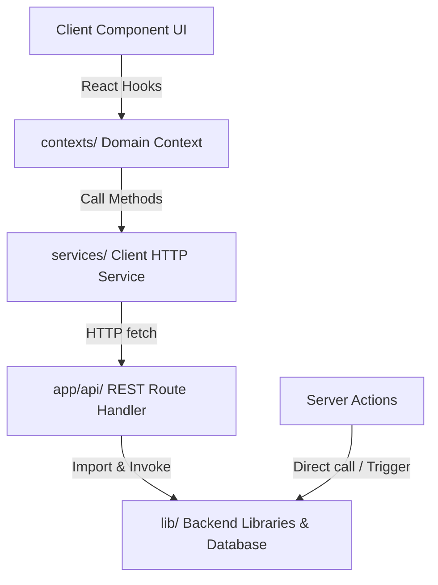

# Implementation Plan: ApplyCopilot Frontend V2 Architecture Rewrite

**Branch**: `002-frontend-v2-architecture` | **Date**: 2026-06-08 | **Spec**: [spec.md](file:///Users/wagnertaiatella/repos/applyCopilot/specs/002-frontend-v2-architecture/spec.md)

---

## 1. Summary
This plan details the technical execution of the ApplyCopilot Frontend V2 rewrite in the `/frontend` directory. The project establishes a robust Next.js 16 (App Router) client backed by PostgreSQL 18 with pgvector, NextAuth v5, Winston logging, and a decoupled Service layer. It implements a unified `ProfileContext` state machine to prevent tab data loss and utilizes a hybrid Ant Design 6 / shadcn/ui UI layer.

---

## 2. Technical Context

* **Language/Version**: TypeScript 5.x, Node.js 22.x
* **Primary Dependencies**: Next.js 16.x (App Router), React 19.x, NextAuth.js v5 (beta), Ant Design 6.x, Tailwind CSS 4.x, Winston, Mammoth, pdf2json, `@dnd-kit/core`, `@dnd-kit/sortable`
* **Storage**: PostgreSQL 18.x with pgvector extension, Prisma 7.x ORM
* **Testing**: Jest for Unit & Integration tests, Playwright for E2E tests
* **Target Platform**: Local development (Docker Compose), Production VPS (Linux bare-metal)
* **Project Type**: Web Application & REST API
* **Performance Goals**: Debounced auto-saves trigger in 1.5 seconds and complete in < 2 seconds. The SSE parser delivers the first chunk within 15 seconds.
* **Constraints**: Standard REST API mapping to support future mobile (Android/iOS) applications. English-only codebase.
* **Scale/Scope**: Single developer local instance, scaling to personal usage in production.

---

## 3. Constitution Check

*GATE: Passed. Complies fully with all Ratified Principles.*

| Principle / Rule | Compliance Status | Implementation Strategy |
| :--- | :--- | :--- |
| **I. Spec-Driven Development** | **Pass** | Spec is finalized and technology-agnostic. Design details are decoupled here. |
| **II. Trunk-Based Development** | **Pass** | Short-lived branch `002-frontend-v2-architecture` created off `main`. |
| **III. Pragmatic Testing** | **Pass** | Jest suite configured; verification occurs at merge boundary with a min 80% coverage. |
| **IV. English-Only Codebase** | **Pass** | All source code, logs, and documentation are written exclusively in English. |
| **V. AI Cost Optimization** | **Pass** | Local Ollama is default parsing provider; premium Gemini is runtime configured. |
| **VI. Privacy by Default** | **Pass** | Uploaded documents are processed in-memory, and only stored locally in debug mode. |
| **VII. UI Consistency** | **Pass** | Ant Design 6 handles layout/forms; shadcn/ui widgets bridge style; default dark theme. |
| **VIII. Centralized Logging** | **Pass** | Central Winston logger outputting to console + debug payload files. |

---

## 4. Complexity Tracking

| Violation | Why Needed | Simpler Alternative Rejected Because |
| :--- | :--- | :--- |
| **Hybrid UI System (AntD + shadcn)** | Ant Design is required for complex tables, DatePickers, and dynamic editable tabs (`editableTabs`). shadcn/ui is used for unstyled landing page cards and layout primitives to make the UI look modern and premium. | Using only shadcn/ui requires writing custom state engines for forms, dates, and tabs from scratch, wasting weeks. Using only Ant Design makes it difficult to achieve modern landing layouts without excessive override styles. |
| **SSE for CV Parsing** | Real-time extraction progress must update the client progressively as individual parser phases complete on the backend. | Standard HTTP polling increases database and CPU overhead substantially. WebSockets requires setting up a dedicated WebSocket adapter and server. |

---

## 5. Project Structure

The project will use the **Option 2: Web application** directory layout as defined in the constitution:

```text
frontend/
├── src/
│   ├── app/
│   │   ├── (auth)/                    # Public auth route group (login, register, forgot-password)
│   │   ├── (main)/                    # Protected main app route group
│   │   │   ├── layout.tsx             # Collapsible sidebar + header frame
│   │   │   ├── dashboard/page.tsx     # Landing dashboard placeholder
│   │   │   ├── profile/page.tsx       # Profile management page
│   │   │   ├── jobs/                  # Job listings placeholders
│   │   │   ├── applications/          # Kanban tracking placeholders
│   │   │   └── settings/              # Admin-only options
│   │   ├── api/                       # REST endpoints (auth handlers, profile CRUD, SSE parser)
│   │   ├── page.tsx                   # Public landing page
│   │   └── middleware.ts              # Route protection middleware
│   ├── components/
│   │   ├── landing/                   # Hero, Features, CTA components
│   │   ├── profile/                   # Editable tabs, form fields, auto-save spinner
│   │   ├── layout/                    # Collapsible sidebar and header navigation
│   │   └── ui/                        # Custom shadcn primitives
│   ├── contexts/
│   │   ├── ProfileContext.tsx         # Context managing shared profile state and debounced PUT requests
│   │   └── AppContext.tsx             # Global state (auth session, dark mode, sidebar toggle)
│   ├── services/
│   │   └── profileService.ts          # REST client wrapper and SSE event listeners
│   └── lib/
│       ├── ai/                        # central aiClient.ts routing
│       ├── db/                        # Prisma client singleton
│       ├── merge/                     # ProfileMergeService deduplication logic
│       ├── rate-limit/                # Upstash-style rate limit helpers
│       └── validation/                # Zod DTO schema definitions
├── prisma/
│   ├── schema.prisma                  # PostgreSQL models definition
│   └── seed.ts                        # Seed file populating SystemConfig settings
└── tests/
    ├── unit/                          # Business logic and helper tests
    └── integration/                   # AI, API client, and DB integration tests
```

---

## 6. Architectural Decision Records (ADRs)

*These technical decisions are moved from the product specification into the implementation plan to preserve documentation separation of concerns:*

### ADR-001: Database — PostgreSQL 18 + pgvector
* **Decision**: Use PostgreSQL 18 with pgvector.
* **Implementation**: Tables are linked with foreign keys and cascading deletes (except CVBullet SetNull actions). Embeddings are queried using Cosine Distance (`<=>`) and indexed using HNSW. Prisma 7.x handles ORM integration.

### ADR-002: State Management — React Context (native, per domain)
* **Decision**: Use React Context API.
* **Implementation**: `ProfileContext` acts as the single source of truth for all tabs. Tab switches preserve client edits. Unsaved changes are debounced in the background.

### ADR-003: API Layer — Clean REST, Mobile-Ready
* **Decision**: Expose clean REST endpoints.
* **Implementation**: Next.js Route Handlers (`app/api/`) handle client REST requests. Future mobile apps will utilize these exact routes. Backend-only tasks (e.g. vector recalculation) use Server Actions.

### ADR-004: UI Libraries — Ant Design 6 + shadcn/ui (hybrid)
* **Decision**: hybrid styling.
* **Implementation**: Ant Design 6 for Forms, DatePickers, and editable tabs. shadcn/ui for cards and landing sections. Tailwind CSS 4 bridges the custom style systems.

### ADR-005: Service Layer — ProfileService
* **Decision**: Decouple HTTP fetches.
* **Implementation**: `src/services/profileService.ts` wraps standard HTTP fetches, parsing SSE events and returning typed DTOs.

### ADR-006: CV Parsing Pipeline — SSE (Server-Sent Events)
* **Decision**: Stream parsing phases.
* **Implementation**: Client sends file via POST to `/api/profile/parse`. Server processes phases in-memory and streams progress events (`ParseProgressEvent`), writing completed phases to the DB before moving to the next.

### ADR-007: AI Provider — Dynamic Routing Client
* **Decision**: Centralized AI routing.
* **Implementation**: `src/lib/ai/aiClient.ts` routes prompts dynamically based on DB values loaded from `SystemConfig`. No direct provider SDK imports in handlers.

### ADR-008: Sub-item Updates — Context-first, Parent PUT
* **Decision**: Consolidated PUT endpoints.
* **Implementation**: Experience, Project, and Education updates (including their bullets) are sent as a single consolidated payload to the parent PUT route. The server reconciles bullet differences.

---

## 7. Architecture Responsibility Mapping



* **Client Components**: Pure UI. Must obtain state only from React Context hooks (e.g. `useProfileContext()`).
* **Domain Contexts**: Keep client-side state, coordinate saving/saved/error statuses, and schedule 1.5s debounced service calls.
* **Client Services**: Standard HTTP wrappers. Never import server-only packages.
* **API Route Handlers**: Authorize tokens, validate request payloads using Zod, and trigger backend service execution.
* **Backend Libraries (`lib/`)**: Read from database, perform LLM calls, and execute text extraction.

---

## 8. Stack Versions (Locked)

| Package | Version | Notes |
| :--- | :--- | :--- |
| **next** | 16.x (latest) | App Router enabled |
| **react** | 19.x (latest) | |
| **prisma** | 7.x | PostgreSQL client |
| **@prisma/client** | 7.x | |
| **next-auth** | v5 (beta) | Auth handler |
| **antd** | 6.x | Forms and Editable Tabs |
| **tailwindcss** | 4.x | Layout styling |
| **zod** | 4.x (or equivalent) | Input validation |
| **@dnd-kit/core** | latest | Drag-and-drop support |
| **winston** | latest | Structured logging |
| **mammoth** | latest | Word text extraction |
| **pdf2json** | latest | PDF text extraction |
| **@google/genai** | latest | Gemini API provider |
| **ollama** | latest | Local Ollama provider |
| **resend** | latest | Forgot-password email client |
| **typescript** | 5.x | |

---

## 9. Plan Amendments

### Amendment 001 — Admin LLM Settings Complement (2026-06-15)

> **Context for drift analysis tools**: The implementation of this spec paused between **Phase 4** (User Story 2 — CV Import) and **Phase 5** (User Story 3 — Profile Editing) of `tasks.md` to accommodate a planned complement feature tracked under a separate spec.

**Complement feature**: [`specs/005-admin-llm-settings`](../005-admin-llm-settings/spec.md)  
**Reason**: After completing Phase 4 (CV parsing pipeline with SSE), the admin configuration surface for the AI provider routing — already referenced in ADR-007 and specified in the constitution (Principle V) as "configurable via the Admin panel" — was missing a UI. Rather than shipping the Profile Editing phase without a working admin panel to configure the LLM providers used during CV parsing, the team decided to implement this complement first.

**Scope of the complement** (does NOT modify this spec's user stories):
- New route `GET/POST /api/admin/llm-config` (separate from all profile routes)
- New page `(main)/settings/page.tsx` — ADMIN-only (sidebar entry already planned in project structure above, see section 5: `settings/ # Admin-only options`)
- New component `components/settings/LLMSettingsPanel.tsx`
- User promotion: `wtaiatella@gmail.com` → `ADMIN` role

**Drift analysis note**: Any drift tool scanning files under `frontend/src/app/(main)/settings/`, `frontend/src/app/api/admin/`, or `frontend/src/components/settings/` should treat these as **planned complement work** covered by `specs/005-admin-llm-settings`, not as spec deviation from this document. The `settings/` directory was already listed in the project structure (section 5) as "Admin-only options".

**Status**: Spec + Plan + Tasks complete for complement. Implementation pending before Phase 5 of this spec resumes.

