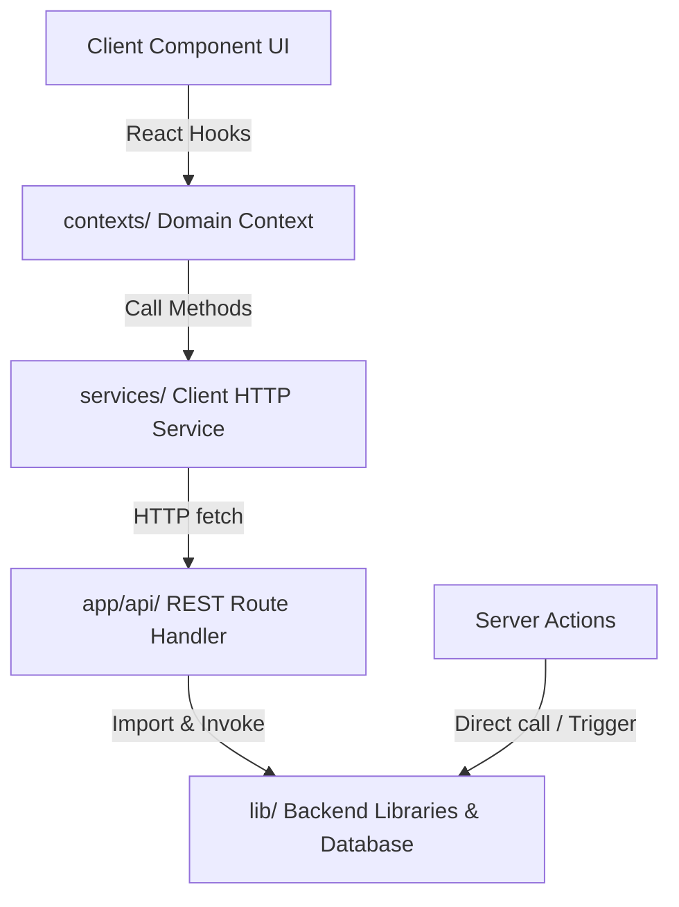

# Feature Specification: ApplyCopilot Frontend V2 — Architecture Rewrite

**Feature Branch**: `002-frontend-v2-architecture`  
**Created**: 2026-06-06  
**Status**: Draft  
**Input**: Strategic architectural decision session + `/grill-me` interview clarification (2026-06-07)

---

## Context & Motivation

This specification defines the architectural decisions and implementation details for the ApplyCopilot Frontend V2. The objective is to build a robust, scalable, and mobile-ready web client that integrates seamlessly with our relational PostgreSQL database.

The architecture focuses on:
- Maintaining a clean, standardized REST API that can be consumed by future native clients (e.g., Android/iOS).
- Implementing a unified client-side state machine using React Context to prevent data loss when navigating between profile sections.
- Enforcing strict, typed DTOs across the client, service, and API layers to prevent payload inconsistencies.
- Standardizing the database schema under PostgreSQL with `pgvector` for efficient vector embeddings and similarity searches.
- Creating a decoupled Service Layer (`src/services/`) that handles all HTTP communication, separating presentation from data fetching.

---

## Clarifications

### Session 2026-06-07

- Q: What language(s) should the Frontend V2 UI support? → A: English only
- Q: How should the system handle concurrent edits to the profile? → A: Last-write-wins (client overwrite based on server timestamp)
- Q: Should raw uploaded CV files be saved for debugging purposes? → A: Save to /debug in dev mode only (persist locally under debug/uploads/ when LOG_LEVEL=debug; always discard in production)
- Q: How should the client trigger and sync the active summary? → A: Consolidated PUT route sync (client sends summaries with isActive: true in PUT /api/profile/basic; server performs the sync to UserProfile internally)
- Q: How should previous password reset tokens be handled when a new reset token is requested? → A: Invalidate previous tokens (delete or mark as used/expired all existing unused reset tokens for that user when a new token is generated)

---

## Architectural Decisions (ADRs)

### ADR-001: Database — PostgreSQL 18 + pgvector

**Decision**: Use PostgreSQL 18 with pgvector extension.

**Rationale**:
- The database schema is fully relational with foreign key constraints, cascading deletes, and multi-table joins.
- PostgreSQL provides true ACID transactions for complex multi-entity operations (such as atomic profile upsert containing bullets, skills, and summaries).
- pgvector enables native vector similarity search for job matching and future RAG capabilities.
- Prisma 7.x is used as the ORM with first-class PostgreSQL support.
- Local instance: PostgreSQL 18.x is used.

**Consequences**:
- Entity IDs use CUID2 (`@default(cuid())`).
- A proper join table `CVBullet` is used instead of string arrays for mapping bullets to CVs.
- Embeddings are stored in the database using the pgvector type `Unsupported("vector(1536)")`.

### ADR-002: State Management — React Context (native, per domain)

**Decision**: Use React's native Context API, organized by domain.

**Rationale**:
- No additional dependency (Zustand, Redux, Jotai) needed for 4 bounded domains
- Server Components in Next.js App Router reduce the need for client-side state significantly
- ProfileContext as single source of truth eliminates the tab-reinit bug
- Zustand remains an option if performance issues arise in future phases

**Context domains**:
- `ProfileContext` — full profile state, loading, error, auto-save methods per section
- `JobContext` — job listings, search state, filters
- `ApplicationContext` — applications pipeline state
- `AppContext` — auth session, theme, global notifications

### ADR-003: API Layer — Clean REST, Mobile-Ready

**Decision**: REST API with resource-oriented routes.

**Rationale**:
- REST routes will be used by the future Android app — keeping them standard and documented
- Route Handlers (`/app/api/`) only for frontend-facing endpoints
- Server Actions for backend-to-backend operations (AI triggers, background jobs, cron)
- No overlapping routes — each route has one responsibility

### ADR-004: UI Libraries — Ant Design 6 + shadcn/ui (hybrid)

**Decision**: Ant Design for data-heavy components; shadcn/ui for layout and visual components.

**Rationale**:
- Ant Design 6 provides production-ready Table, Form, Select, DatePicker, Upload with complex behaviors built-in
- Ant Design `Tabs` with `editableTabs` prop handles the per-item tab pattern (rename on double-click, add/remove)
- shadcn/ui provides unstyled, composable primitives for premium visual design (cards, navigation, dialogs, badges)
- Tailwind CSS 4 bridges both
- framer-motion for animations (already proven in frontend_V0 landing page)

### ADR-005: Service Layer — ProfileService, JobService, ApplicationService

**Decision**: A typed service layer (`src/services/`) abstracts all API calls.

**Rationale**:
- Components call service methods, not raw `fetch()` — enabling easy mocking in tests
- Services receive typed DTOs, return typed DTOs — no `any` types
- One place to handle auth headers, error normalization, retries

### ADR-006: CV Parsing Pipeline — SSE (Server-Sent Events)

**Decision**: The CV parsing pipeline uses SSE for real-time progress streaming. Phase 2 will introduce BullMQ + Redis for job search background workers; SSE may be replaced/supplemented at that point.

**Rationale**:
- One single POST from the client; server streams progress events as each AI parsing phase completes
- Zero additional infrastructure (no Redis, no BullMQ) for Phase 1
- Natural integration with ProfileContext: each SSE event triggers a context update, populating tabs progressively
- If the connection drops mid-parse, already-persisted phases are not lost (each phase saves to DB on completion)
- BullMQ + Redis is the right choice for Phase 2 background job search workers; CV parsing can optionally migrate to it then

**SSE event shape**:
```typescript
type ParseProgressEvent =
  | { phase: 'upload';    progress: 20; status: 'Text extracted' }
  | { phase: 'basic';     progress: 40; status: 'Basic info parsed'; data: BasicDataDTO }
  | { phase: 'experiences'; progress: 60; status: 'Experiences parsed'; data: ExperienceDTO[] }
  | { phase: 'projects';  progress: 80; status: 'Projects parsed'; data: ProjectDTO[] }
  | { phase: 'education'; progress: 100; status: 'Education & skills parsed'; data: { education: EducationDTO[]; skills: SkillDTO[] } }
  | { phase: 'error';     progress: number; error: string };
```

### ADR-007: AI Provider — Dynamic Routing Client

**Decision**: The AI client (`src/lib/ai/aiClient.ts`) routes prompts to the designated provider (Google/Gemini, Ollama, Claude, etc.) dynamically.

**Rationale**:
- The active provider for each AI capability (e.g. CV parsing, summary generation) is resolved at runtime based on database-backed `SystemConfig` settings or fallback environment variables (e.g. `AI_PROVIDER_PARSING`, `AI_PROVIDER_SUMMARIES`).
- Configured providers are resolved dynamically based on availability, developer preference, or admin panel overrides.

```env
AI_PROVIDER_DEFAULT=ollama       # Default fallback provider
AI_PROVIDER_PARSING=ollama       # Specific capability routing
AI_PROVIDER_SUMMARIES=gemini     # Specific capability routing
GEMINI_API_KEY=...
OLLAMA_BASE_URL=http://localhost:11434
CLAUDE_API_KEY=...
```

A single `src/lib/ai/aiClient.ts` abstraction maps capability targets to the configured provider; all routes use only this centralized client.

### ADR-008: Sub-item Updates — Context-first, Parent PUT

**Decision**: Bullets, summary reordering/editing, and `freeFormContext` are NOT managed via dedicated sub-routes. All changes flow through the parent entity's PUT route.

**Rationale**:
- `ProfileContext` holds the complete entity in memory (including bullets array with current `sortOrder`, `isActive`, `isArchived`, `type`, and `text`)
- The 1.5s debounce fires once, sending the full updated entity — no need for separate bullet-level API calls
- `PUT /api/profile/experiences/[id]` receives the complete `ExperienceDTO` (fields + bullets array in current order + freeFormContext) and reconciles the diff server-side
- `PUT /api/profile/basic` receives the full `BasicDataDTO` including the `summaries` array (sorted, with updated `sortOrder`) — handles reordering, edits, and deletion of summaries in a single call
- Exception: `POST /api/profile/summaries/generate` is required as a dedicated route because it is an AI call, not a client-side data mutation

---

## User Scenarios & Testing

### User Story 1 — Landing Page & Authentication (Priority: P0)

As a visitor, I want to see a compelling landing page that explains the product and allows me to sign up or log in, so I understand the value and can access my account.

**Landing Page Sections** (in order):
1. **Hero** — headline, sub-headline, primary CTA ("Get Started" / "Go to Dashboard" if authenticated)
2. **Features** — 3-4 feature cards highlighting core value propositions
3. **How It Works** — 3-step visual walkthrough
4. **CTA Final** — secondary call-to-action to convert scrollers

**Acceptance Scenarios**:
1. **Given** I visit the root URL unauthenticated, **When** the page loads, **Then** I see the landing page with Hero, Features, How It Works, and CTA sections with Login and Get Started buttons in the nav
2. **Given** I visit the root URL authenticated, **When** the page loads, **Then** the navigation shows "Dashboard" instead of Login/Register, and the hero CTA changes to "Go to Dashboard"
3. **Given** I click Get Started, **When** the register page loads, **Then** I can create an account with email + password
4. **Given** I click Log In, **When** the login page loads, **Then** I can authenticate and am redirected to `/dashboard`
5. **Given** I click "Forgot Password" on the login page, **When** I submit my email, **Then** I receive a reset link email (via Resend) within 60 seconds that expires after 24 hours
6. **Given** I follow the password reset link, **When** I submit a new password, **Then** my password is updated and I am redirected to the login page

**Out of scope for Phase 1**: OAuth (Google, GitHub), magic links, 2FA.

---

### User Story 2 — Profile Setup via CV Import (Priority: P1)

As a new user, I want to upload my CV and have my profile automatically populated so I don't have to enter everything manually.

**Accepted file formats**: PDF and DOCX only.

**Acceptance Scenarios**:
1. **Given** I am on the Profile page, **When** I upload a PDF or DOCX CV, **Then** the system initiates a single SSE-streamed request to `/api/profile/parse` and the UI displays real progress (20% → 40% → 60% → 80% → 100%) as each AI phase completes
2. **Given** the AI completes the "basic" phase (40%), **When** the SSE event arrives, **Then** the BasicData tab is immediately populated in the UI without waiting for the remaining phases
3. **Given** parsing is complete, **When** I view my profile, **Then** all sections (basicData, experiences, education, projects, skills) are pre-filled with extracted data
4. **Given** parsing fails at any intermediate phase (e.g., network error after 60%), **When** the error occurs, **Then** data from already-completed phases is preserved in the database; the user sees an error message indicating which phase failed and can retry
5. **Given** I upload a second CV later, **When** the system saves, **Then** it merges rather than duplicates — matching experiences by `company` (case-insensitive, normalized), projects by `name` (normalized), and bullets by exact text match after normalization (lowercase + trim + punctuation removal)

**Merge normalization rules** (for `ProfileMergeService`):
- Text normalization: `toLowerCase().trim().replace(/[^\w\s]/g, '')`
- Experience match key: normalized `company` only (permits same company / different position without creating a duplicate company entry; new positions are appended as new experiences under the same company)
- Project match key: normalized `name`
- Bullet match key: normalized `text` (exact match after normalization)

**CV file handling**: The uploaded file is processed in-memory on the server (text extraction via `mammoth` for DOCX, `pdf2json` for PDF) and discarded immediately after text extraction. In development mode (when `LOG_LEVEL=debug`), the raw uploaded CV files are saved to the `debug/uploads/` directory for troubleshooting text extraction failures. No permanent storage of the raw file is allowed in production.

---

### User Story 3 — Profile Editing (Priority: P1)

As a user, I want to add, edit, and delete items in all profile sections without losing data when switching tabs.

**Profile Page Layout**:
- Horizontal tabs at the top of the profile page, one tab per section
- **BasicData**: single form (no inner tabs) — name, email, phone, location, LinkedIn, GitHub, website, active summary selector
- **Experiences / Education / Projects**: each item is its own editable tab (tab label = company name / institution / project name, editable on double-click using Ant Design `editableTabs`)
- **Skills / References**: list views within a single tab

**Auto-save behavior**:
- Edits are stored immediately in `ProfileContext` (no data loss on tab switch)
- A **per-section debounce of 1.5s** triggers an automatic API save after the user stops typing
- A discrete status indicator in the page header shows `Saving...` (spinner) or `Saved ✓` (green) — no toast interruptions
- If auto-save fails, the indicator shows `Error — retry` with a manual retry button

**Acceptance Scenarios**:
1. **Given** I edit my name in the Basic Data tab, **When** I switch to Experiences tab and back, **Then** my unsaved edits are preserved in the ProfileContext (and auto-saved within 1.5s)
2. **Given** I add a new experience, **When** I save, **Then** it appears immediately as a new tab without a full page reload
3. **Given** I delete a bullet point that was used in a generated CV, **When** I save, **Then** the bullet is soft-deleted (hidden from the active profile UI, preserved in DB with `isArchived: true`)
4. **Given** I add skills manually, **When** the debounce fires, **Then** the skills list is updated atomically (no partial saves)
5. **Given** I double-click a tab label (experience, project, education), **When** I type a new name and confirm, **Then** the tab label and the underlying entity name (`company`, `name`, `institution`) are updated

---

### User Story 4 — Profile Tab UX Detail (Priority: P1)

As a user managing my profile, I want each tab to have rich, intuitive controls so I can manage my information efficiently.

#### Basic Data Tab — Summaries

**Summaries sub-section** (within Basic Data tab, below contact fields):

- Lists all `ProfileSummary` records for the user, each showing: title, content preview, `isAIGenerated` badge, and `isActive` radio-button selector
- **Manual creation**: "+ Add Summary" button opens an inline form with title + content textarea
- **AI generation**: "✨ Generate with AI" button opens a modal (as shown in the design images) with:
  - Explanatory text: "The AI will read your entire profile (experiences, projects, skills, education) and generate a compelling 3–5 line introduction."
  - A free-text `<textarea>` for user instructions (e.g. "Focus on my leadership experience in remote teams")
  - "Cancel" and "Generate" buttons
  - On Generate: calls `POST /api/profile/summaries/generate` with the user instructions; the AI receives the full profile context
  - On success: new summary appears in the list with `isAIGenerated: true`
- **Drag-and-drop ordering**: summaries list is reorderable via drag-and-drop (using `@dnd-kit/core` or Ant Design `SortableList` if available). Order is persisted to the DB via a `sortOrder` field on `ProfileSummary`
- **Active summary**: selecting one summary as active marks it `isActive` in `ProfileContext`. When the debounced `PUT /api/profile/basic` runs, the server handler internally invokes the sync logic (equivalent to the backend `syncActiveSummary` routine) to populate the main `UserProfile.summary` and `UserProfile.title` fields with the active summary's content and title
- **Delete**: each summary has a delete icon; if it is the active summary, prompt confirmation before deleting

> **Summary mutations**: create, edit, reorder, and delete are managed via `PUT /api/profile/basic` (sends full `summaries` array in current order). The only dedicated summary route is the AI generation call below.

| Method | Route | Purpose | Auth |
|--------|-------|---------|------|
| POST | `/api/profile/summaries/generate` | AI: generate summary from full profile + user instructions | ✅ |

#### Experiences Tab — Per-experience Form

Each experience item is rendered as an editable tab. Form fields per experience:

- **Company** (required) + **Position** (required) — side by side
- **Dates**: Start date picker → End date picker. End date field has a **"Current / Present" checkbox** next to it; when checked, the end date picker is disabled and the value is set to `null` with `current: true`
- **Highlights & Achievements** — bullet list (as shown in the Experiences screenshot):
  - Each row: `•` or blank prefix (visual indicator of type) | text input | **Type dropdown** (`Bullet` / `Paragraph`) | **Active checkbox** | 🗑 delete button
  - **CV usage badge**: if `usedInCVs.length > 0`, show a count badge next to the active checkbox. Hovering the badge shows a popover listing the CV names as clickable links (links point to future `/cv/[id]` route — render as plain text in Phase 1 if route not yet implemented)
  - **Drag-and-drop ordering** of bullets within an experience using `@dnd-kit/sortable`
  - "+ Add Highlight" button appends a new bullet row with default type `BULLET`
- **Context / Additional Details**: textarea at the bottom of each experience (as shown in the screenshot). Free-form text used by AI for: generating new bullets, extracting skills, writing summaries and cover letters. Label: "Context / Additional Details". Placeholder: "Any extra information about this role, key projects, achievements, impact..."

#### Education Tab — Per-education Form

Each education item is rendered as an editable tab. Form fields:

- **Institution** (required) + **Degree** (required) — side by side
- **Field of Study** — full width
- **Dates**: Start date + End date. End date has:
  - **"Current" checkbox**: when checked, end date disabled, `current: true`
  - **"Hide end date" checkbox**: when checked, end date is stored but not shown on CV output (`hideEndDate: true` field on Education model)
- **Bullet Points / Achievements**: same bullet row UI as Experiences (type dropdown, active checkbox, delete, drag-and-drop). Less common for education but supported per spec.
- **Context / Additional Details**: same textarea as Experiences

#### Projects Tab — Per-project Form

Each project item is rendered as an editable tab. Form fields (as shown in the Projects screenshot):

- **Project Name** (required) — left side
- **Dates**: Start date → End date with **"Current" checkbox** (same behavior as Experiences)
- **Technologies**: multi-select tag input (comma-separated or select from existing skill names)
- **Highlights & Features**: same bullet row UI as Experiences — type dropdown, active checkbox, CV usage badge, drag-and-drop, delete
- **Context / Additional Details**: textarea (label: "Role, impact...")

**AI fallback for missing projects**: If the CV parsing phase returns an empty projects array, the SSE pipeline MUST automatically trigger a dedicated AI prompt that receives the **full CV text** and asks the model to analyze experiences and extract any relevant projects. Prompt pattern: *"Analyze the following CV and extract any meaningful projects, side projects, or significant initiatives that can be identified from the work experience. For each, provide name, technologies used, approximate dates, and 2–4 bullet highlights."*

#### Skills Tab

- Each skill row: **name** | **Proficiency** dropdown (`BEGINNER` / `INTERMEDIATE` / `ADVANCED` / `EXPERT`) | **Years of experience** (number input) | delete button
- No category fields — keeps the UI simple and focused
- Skills are displayed in a single flat list, sorted alphabetically
- **Auto-suggest from profile**: button "Extract skills from profile" runs a Server Action that reads technologies from experiences + projects and creates skill entries for any that don't already exist (name + default proficiency `INTERMEDIATE`)
- **AI fallback for missing skills**: If the CV parsing phase returns an empty skills array, the SSE pipeline MUST automatically trigger a dedicated AI prompt that receives the **full CV text** and asks the model to extract skills. Prompt pattern: *"Extract all technical and soft skills from the following CV as a flat list. For each skill, estimate proficiency level (BEGINNER/INTERMEDIATE/ADVANCED/EXPERT) based on context and years of use."*

#### References Tab

Simple list with name, company, relationship, email, phone, canContact toggle. Reserved for future features.

---

## Functional Requirements

### Phase 1: Foundation + Profile

- **FR2-001**: System MUST render a landing page at `/` with sections: Hero, Features (3-4 cards), How It Works (3 steps), and CTA Final. The page MUST adapt CTA buttons based on authentication state (Login/Register vs Dashboard)
- **FR2-002**: System MUST use Next.js 16+ App Router with route groups: `(auth)` for public pages, `(main)` for authenticated app. Route protection MUST be implemented via `middleware.ts` — redirecting unauthenticated requests to `/login` before the page renders (no client-side flash)
- **FR2-003**: System MUST define canonical TypeScript DTOs in `src/types/` used consistently by services, API routes, and components — no `any` types in public interfaces
- **FR2-004**: System MUST implement a `ProfileContext` that holds the complete profile state and exposes typed auto-save methods per section. Tabs MUST NOT maintain independent local state. Full profile data is loaded once on page entry (`GET /api/profile`) and tabs only render subsets of that shared state
- **FR2-005**: System MUST implement a `ProfileService` in `src/services/profileService.ts` with individual typed methods for each CRUD operation and the `parseCV` streaming method
- **FR2-006**: The profile API MUST follow REST conventions with one responsibility per route (see API route table in Architecture section)
- **FR2-007**: System MUST use Prisma 7.x with PostgreSQL provider and pgvector extension installed
- **FR2-008**: System MUST use CUID2 as the ID strategy for all models
- **FR2-009**: The CV import pipeline MUST use SSE (Server-Sent Events): a single POST to `/api/profile/parse` streams `ParseProgressEvent` objects as each AI phase completes. Each completed phase MUST be persisted to the database before the next phase begins, ensuring partial progress survives connection drops
- **FR2-010**: Bullet point merge logic MUST be centralized in a single `ProfileMergeService` (`src/lib/merge/profileMergeService.ts`), called by all routes that handle experiences/projects — no duplication. Deduplication uses normalized exact match: `text.toLowerCase().trim().replace(/[^\w\s]/g, '')`
- **FR2-011**: System MUST implement soft-delete for bullets. Archived bullets (`isArchived: true`) are hidden from the active profile UI but preserved in the database to prevent relational failures in historical CV records
- **FR2-012**: Skills MUST be auto-suggested from existing profile data (experiences technologies + projects technologies) as a convenience feature in the Skills tab
- **FR2-013**: System MUST support two user roles: `USER` (default) and `ADMIN`. Role is stored as enum in the `User` model and included as a JWT claim in the NextAuth session. The sidebar Settings link is visible only to ADMIN users. ADMIN Settings includes: user management, portal configuration, and usage metrics
- **FR2-014**: System MUST implement a collapsible sidebar navigation with the following behavior:
  - `>= 1280px`: expanded by default (icon + label)
  - `< 1280px`: collapsed by default (icon only)
  - User preference is persisted in `localStorage` after first manual interaction
  - Header contains: site logo/name on the left, user session controls (avatar, logout) on the right
- **FR2-015**: System MUST support dark mode as the default theme, with a toggle to switch to light mode. Theme preference is persisted in `localStorage`
- **FR2-016**: System MUST implement the complete forgot-password flow: request reset (email input → Resend delivers link), reset token validation, new password submission. Reset tokens expire after 24 hours. Generating a new token MUST invalidate (delete or mark as expired) all previous unused tokens for the requesting user. Rate limit: max 3 requests per hour per email
- **FR2-017**: The `/dashboard` page in Phase 1 MUST display a welcome message and a link to the profile page. No stats or data widgets are required in Phase 1
- **FR2-018**: The AI client abstraction (`src/lib/ai/aiClient.ts`) MUST resolve the active provider for each capability at runtime, looking up values in database-backed portal settings (via `SystemConfig`) with fallback to environment variables (e.g. `AI_PROVIDER_PARSING`, `AI_PROVIDER_SUMMARIES`, or `AI_PROVIDER_DEFAULT`). Supported providers include `ollama`, `gemini`, and `claude`. All AI operations MUST use only this routing client — no direct imports of provider SDKs in route handlers.

- **FR2-019**: The Summaries sub-section in Basic Data MUST support both manual creation (inline form) and AI-assisted generation. AI generation MUST open a modal with a free-text instructions field; the AI receives the full profile context and user instructions via `POST /api/profile/summaries/generate`
- **FR2-020**: Summaries MUST be reorderable via drag-and-drop (`@dnd-kit/core`). Order is persisted to the DB via the `sortOrder` field on `ProfileSummary`. Reorder changes are managed in `ProfileContext` and sent via `PUT /api/profile/basic` (full `summaries` array in current order)
- **FR2-021**: All experience bullet lists, project bullet lists, and education bullet lists MUST support drag-and-drop reordering within their parent item (`@dnd-kit/sortable`). The `sortOrder` field on each bullet model persists the order, sent as part of the parent entity's PUT payload
- **FR2-022**: Each bullet row (experience, project, education) MUST have a Type dropdown with two options: `Bullet` (renders with bullet prefix `•`) and `Paragraph` (renders without prefix, as a paragraph). The `type` field on `ExperienceBullet`, `ProjectBullet`, and `EducationBullet` persists this
- **FR2-023**: The Dates section of Experience, Education, and Project items MUST include a **"Current / Present" checkbox** next to the end date picker. When checked: end date picker is disabled, `endDate` is set to `null`, and `current` is set to `true`. Education items additionally have a **"Hide end date"** checkbox that sets `hideEndDate: true` without disabling the picker
- **FR2-024**: If a bullet's `usedInCVs.length > 0`, the bullet row MUST display a count badge. Hovering the badge shows a popover listing CV names. In Phase 1, CV names are rendered as plain text (links to `/cv/[id]` deferred to a future phase)
- **FR2-025**: If the CV parsing SSE pipeline produces zero projects after the projects phase, the system MUST automatically trigger a secondary AI prompt with the full CV text to extract projects from experience descriptions.
- **FR2-026**: If the CV parsing SSE pipeline produces zero skills after the education-skills phase, the system MUST automatically trigger a secondary AI prompt with the full CV text to extract a flat skills list with proficiency levels
- **FR2-027**: The Skills tab MUST display a single flat list of skills (name + proficiency + years of experience). No category fields or sub-sections in the UI
- **FR2-028**: System MUST implement structured, centralized logging via Winston:
  - **Console Output**: Levels `INFO`, `WARN`, and `ERROR` must log directly to the server terminal.
  - **Debug Tracing**: `DEBUG` level messages must trace inputs and outputs of key pipeline stages (e.g., CV parsing phases).
  - **Payload Auditing**: In development mode (when `LOG_LEVEL=debug`), API payloads, responses, LLM call parameters, and raw uploaded CV files (saved under `debug/uploads/`) must be saved in the `/debug` directory as flat, chronological files. The text-based payloads use the format: `YYYY-MM-DD-HH-mm-ss-<requestId>-<description>.<ext>`.
  - **Global Log File**: When in debug mode and the environment variable `DEBUG_SAVE_EXTRACTED_TEXT="true"` is enabled, the logger MUST also record all combined logs to a global file at `debug/global.log`.
- **FR2-029**: Automated testing (unit and integration tests) MUST be written and maintained as the project evolves, specifically verified and passing at the delivery boundary of each main feature/deliverable (prior to merging a Merge Request / Pull Request), rather than strictly blocking every intermediate commit.
- **FR2-030**: The Frontend V2 user interface MUST be implemented in English only (no multi-language localization required in Phase 1).
- **FR2-031**: System MUST resolve concurrent profile updates using a last-write-wins strategy (server overwrites DB values with the latest received payload without performing version conflict checks).

---

## Database Schema (PostgreSQL + Prisma 7.x)

### Schema Design

```prisma
datasource db {
  provider = "postgresql"
  url      = env("DATABASE_URL")
}

generator client {
  provider = "prisma-client-js"
}

enum Role {
  USER
  ADMIN
}

enum BulletType {
  BULLET
  PARAGRAPH
}

enum ProficiencyLevel {
  BEGINNER
  INTERMEDIATE
  ADVANCED
  EXPERT
}

model User {
  id        String   @id @default(cuid())
  email     String   @unique
  password  String
  role      Role     @default(USER)
  createdAt DateTime @default(now())
  profile   UserProfile?
  sessions  Session[]
}

model UserProfile {
  id              String           @id @default(cuid())
  userId          String           @unique
  createdAt       DateTime         @default(now())
  updatedAt       DateTime         @updatedAt
  
  // Basic Information
  firstName       String?
  lastName        String?
  title           String?
  summary         String?
  location        String?
  phone           String?
  website         String?
  github          String?
  linkedin        String?
  
  // pgvector embedding field (stored as PostgreSQL vector)
  embedding       Unsupported("vector(1536)")?

  // Relations
  user            User             @relation(fields: [userId], references: [id], onDelete: Cascade)
  experiences     Experience[]
  education       Education[]
  projects        Project[]
  skills          Skill[]
  references      Reference[]
  summaries       ProfileSummary[]
  cvs             CV[]
}

model Experience {
  id              String             @id @default(cuid())
  profileId       String
  company         String
  position        String
  startDate       DateTime
  endDate         DateTime?
  current         Boolean            @default(false)
  freeFormContext String?
  
  profile         UserProfile        @relation(fields: [profileId], references: [id], onDelete: Cascade)
  bullets         ExperienceBullet[]
}

model ExperienceBullet {
  id           String     @id @default(cuid())
  experienceId String
  text         String
  isActive     Boolean    @default(true)
  isArchived   Boolean    @default(false)
  type         BulletType @default(BULLET)
  sortOrder    Int        @default(0)
  
  experience   Experience @relation(fields: [experienceId], references: [id], onDelete: Cascade)
  usedInCVs    CVBullet[]
}

model Education {
  id              String            @id @default(cuid())
  profileId       String
  institution     String
  degree          String
  fieldOfStudy    String?
  startDate       DateTime
  endDate         DateTime?
  current         Boolean           @default(false)
  hideEndDate     Boolean           @default(false)
  freeFormContext String?
  
  profile         UserProfile       @relation(fields: [profileId], references: [id], onDelete: Cascade)
  bullets         EducationBullet[]
}

model EducationBullet {
  id          String     @id @default(cuid())
  educationId String
  text        String
  isActive    Boolean    @default(true)
  isArchived  Boolean    @default(false)
  type        BulletType @default(BULLET)
  sortOrder   Int        @default(0)
  
  education   Education  @relation(fields: [educationId], references: [id], onDelete: Cascade)
  usedInCVs   CVBullet[]
}

model Project {
  id              String          @id @default(cuid())
  profileId       String
  name            String
  startDate       DateTime?
  endDate         DateTime?
  current         Boolean         @default(false)
  technologies    String[]        // Stored as text array in PostgreSQL
  freeFormContext String?
  
  profile         UserProfile     @relation(fields: [profileId], references: [id], onDelete: Cascade)
  bullets         ProjectBullet[]
}

model ProjectBullet {
  id         String     @id @default(cuid())
  projectId  String
  text       String
  isActive   Boolean    @default(true)
  isArchived Boolean    @default(false)
  type       BulletType @default(BULLET)
  sortOrder  Int        @default(0)
  
  project    Project    @relation(fields: [projectId], references: [id], onDelete: Cascade)
  usedInCVs  CVBullet[]
}

model Skill {
  id              String           @id @default(cuid())
  profileId       String
  name            String
  proficiency     ProficiencyLevel
  yearsExperience Int?
  
  profile         UserProfile      @relation(fields: [profileId], references: [id], onDelete: Cascade)

  @@unique([profileId, name])
}

model Reference {
  id           String      @id @default(cuid())
  profileId    String
  name         String
  company      String?
  relationship String?
  email        String?
  phone        String?
  canContact   Boolean     @default(false)
  
  profile      UserProfile @relation(fields: [profileId], references: [id], onDelete: Cascade)
}

model ProfileSummary {
  id            String      @id @default(cuid())
  profileId     String
  title         String
  content       String
  isAIGenerated Boolean     @default(false)
  isActive      Boolean     @default(false)
  sortOrder     Int         @default(0)
  createdAt     DateTime    @default(now())
  
  profile       UserProfile @relation(fields: [profileId], references: [id], onDelete: Cascade)
}

model CV {
  id        String     @id @default(cuid())
  profileId String
  name      String
  s3Key     String?
  createdAt DateTime   @default(now())
  
  profile   UserProfile @relation(fields: [profileId], references: [id], onDelete: Cascade)
  bullets   CVBullet[]
}

model CVBullet {
  id                 String            @id @default(cuid())
  cvId               String
  experienceBulletId String?
  projectBulletId    String?
  educationBulletId  String?

  cv               CV                @relation(fields: [cvId], references: [id], onDelete: Cascade)
  experienceBullet ExperienceBullet? @relation(fields: [experienceBulletId], references: [id], onDelete: Cascade)
  projectBullet    ProjectBullet?    @relation(fields: [projectBulletId], references: [id], onDelete: Cascade)
  educationBullet  EducationBullet?  @relation(fields: [educationBulletId], references: [id], onDelete: Cascade)
}

model Session {
  id        String   @id @default(cuid())
  userId    String
  token     String   @unique
  expiresAt DateTime
  createdAt DateTime @default(now())
  
  user      User     @relation(fields: [userId], references: [id], onDelete: Cascade)
}

model PasswordResetToken {
  id        String    @id @default(cuid())
  userId    String
  token     String    @unique
  expiresAt DateTime
  usedAt    DateTime?
  createdAt DateTime  @default(now())

  user      User      @relation(fields: [userId], references: [id], onDelete: Cascade)
}

model SystemConfig {
  key   String @id
  value String
}
```


### Entity Relationships

```
User
  ├── UserProfile (1:1)
  │   ├── Experience[] (1:N)
  │   │   └── ExperienceBullet[] (1:N)
  │   ├── Education[] (1:N)
  │   │   └── EducationBullet[] (1:N)
  │   ├── Project[] (1:N)
  │   │   └── ProjectBullet[] (1:N)
  │   ├── Skill[] (1:N)
  │   ├── Reference[] (1:N)
  │   ├── ProfileSummary[] (1:N)
  │   └── CV[] (1:N)
  │       └── CVBullet[] (join: CV ↔ ExperienceBullet/ProjectBullet/EducationBullet)
  └── Session[]
```

**Bullet models** (`ExperienceBullet`, `ProjectBullet`, `EducationBullet`) share the same field contract:

| Field | Type | Notes |
|---|---|---|
| `id` | `String @id @default(cuid())` | |
| `text` | `String` | Content of the bullet |
| `type` | `BulletType` | `BULLET` or `PARAGRAPH` |
| `isActive` | `Boolean @default(true)` | Controls visibility in CV output |
| `isArchived` | `Boolean @default(false)` | Soft-delete — preserved for CV relational integrity |
| `sortOrder` | `Int @default(0)` | Drag-and-drop position within parent |

`usedInCVs` is computed at query time via the `CVBullet` join table — not stored on the bullet model.

**`CV` model** (tracks generated resume versions):

| Field | Type | Notes |
|---|---|---|
| `id` | `String @id @default(cuid())` | |
| `name` | `String` | User-defined label (e.g. "Senior Frontend — Google") |
| `s3Key` | `String?` | S3 path of generated PDF (Phase 3) |
| `createdAt` | `DateTime @default(now())` | |
| `profileId` | `String` | FK → `UserProfile` |
| `bullets` | `CVBullet[]` | Join to active bullets at generation time |

**`CVBullet` join table** (links a `CV` to the specific bullets it included):

| Field | Type | Notes |
|---|---|---|
| `cvId` | `String` | FK → `CV` |
| `experienceBulletId` | `String?` | FK → `ExperienceBullet` |
| `projectBulletId` | `String?` | FK → `ProjectBullet` |
| `educationBulletId` | `String?` | FK → `EducationBullet` |

### pgvector Setup

```sql
CREATE EXTENSION IF NOT EXISTS vector;
-- Applied once after initial migration
```

Profile embedding field (Phase 2):
```prisma
embedding Unsupported("vector(1536)")?
```

---

## API Routes (Phase 1 — Frontend-facing only)

| Method | Route | Purpose | Auth |
|--------|-------|---------|------|
| GET | `/api/profile` | Full profile with all sections | ✅ |
| PUT | `/api/profile/basic` | Update basicData + active summary | ✅ |
| POST | `/api/profile/experiences` | Create new experience | ✅ |
| PUT | `/api/profile/experiences/[id]` | Update experience + bullets | ✅ |
| DELETE | `/api/profile/experiences/[id]` | Delete experience | ✅ |
| POST | `/api/profile/education` | Create education entry | ✅ |
| PUT | `/api/profile/education/[id]` | Update education entry | ✅ |
| DELETE | `/api/profile/education/[id]` | Delete education entry | ✅ |
| POST | `/api/profile/projects` | Create project | ✅ |
| PUT | `/api/profile/projects/[id]` | Update project + bullets | ✅ |
| DELETE | `/api/profile/projects/[id]` | Delete project | ✅ |
| PUT | `/api/profile/skills` | Replace full skills list | ✅ |
| PUT | `/api/profile/references` | Replace full references list | ✅ |
| POST | `/api/profile/summaries/generate` | AI: generate summary from full profile + instructions | ✅ |
| POST | `/api/profile/parse` | SSE stream: upload + AI parse all sections | ✅ |
| POST | `/api/auth/[...nextauth]` | NextAuth handler | ❌ |
| POST | `/api/auth/register` | New user registration | ❌ |
| POST | `/api/auth/forgot-password` | Password reset request (sends email via Resend) | ❌ |
| POST | `/api/auth/reset-password` | Apply reset token | ❌ |

> **Note on `/api/profile/parse`**: The server orchestrates all AI parsing phases internally, streaming progress via SSE. The client sends the file once and listens to the event stream.

> **Note on sub-item mutations (bullets, summary reordering, freeFormContext)**: These are NOT separate API routes. `ProfileContext` holds the full entity state in memory; the debounced auto-save sends the complete updated entity to the parent's PUT route (e.g. `PUT /api/profile/experiences/[id]` receives the full experience including its bullets array in current order). The server reconciles the diff. The only exception is `POST /api/profile/summaries/generate`, which is an AI-triggered call.

**Server Actions** (backend-to-backend, not exposed as HTTP):
- `triggerProfileEmbedding(profileId)` — regenerate vector embedding after profile update
- `syncActiveSummary(profileId)` — internal utility called during `PUT /api/profile/basic` execution to sync the active summary to profile title/summary fields

---

## Frontend Architecture

### Directory Structure

```
frontend/
└── src/
    ├── app/
    │   ├── (auth)/                    # Public route group
    │   │   ├── login/page.tsx
    │   │   ├── register/page.tsx
    │   │   └── forgot-password/page.tsx
    │   ├── (main)/                    # Authenticated route group
    │   │   ├── layout.tsx             # Collapsible sidebar + header layout
    │   │   ├── dashboard/page.tsx     # Welcome message + link to profile
    │   │   ├── profile/page.tsx       # ProfileContext provider wraps this
    │   │   ├── jobs/
    │   │   │   ├── page.tsx           # Job discovery list
    │   │   │   └── [id]/page.tsx      # Job detail
    │   │   ├── applications/page.tsx
    │   │   └── settings/page.tsx      # ADMIN only — user mgmt, portals, metrics
    │   ├── page.tsx                   # Landing page (root, public)
    │   └── api/                       # Route Handlers (frontend-facing only)
    │       ├── auth/
    │       └── profile/
    │
    ├── middleware.ts                  # Route protection — at src/ root (Next.js App Router requirement)
    ├── components/
    │   ├── landing/                   # Hero, Features, HowItWorks, CTAFinal sections
    │   ├── profile/                   # Profile forms, editable tabs, auto-save indicator
    │   ├── jobs/                      # Job cards and filters
    │   ├── applications/              # Kanban and status components
    │   ├── layout/                    # Sidebar (collapsible), Header, Nav
    │   └── ui/                        # Shared primitives (shadcn/ui based)
    │
    ├── contexts/
    │   ├── ProfileContext.tsx          # Full profile state + per-section debounced auto-save
    │   ├── JobContext.tsx
    │   ├── ApplicationContext.tsx
    │   └── AppContext.tsx             # Auth session, theme (dark/light), sidebar state
    │
    ├── services/
    │   ├── profileService.ts          # Typed methods + parseCV SSE stream helper
    │   ├── jobService.ts
    │   └── applicationService.ts
    │
    ├── lib/
    │   ├── api/                       # Response helpers, error classes
    │   ├── auth/                      # NextAuth v5 config + Prisma adapter
    │   ├── db/                        # Prisma client singleton
    │   ├── ai/                        # aiClient.ts — Ollama/Gemini abstraction
    │   ├── parsing/                   # CV text extraction (mammoth, pdf2json)
    │   ├── merge/                     # ProfileMergeService (centralized dedup logic)
    │   ├── rate-limit/
    │   └── validation/                # Zod schemas
    │
    └── types/
        ├── profile.ts                 # ProfileDTO, ExperienceDTO, BulletDTO, ParseProgressEvent, etc.
        ├── jobs.ts
        ├── application.ts
        └── auth.ts
```

### Architecture Responsibility Mapping

In Next.js App Router applications, responsibilities can easily become blurred between client and server. To support a **future mobile application (Android/iOS)** while keeping a clean separation of concerns, the following architectural layer boundaries must be strictly followed:



| Layer | Run Location | Access Rules | Responsibilities & Purpose |
| :--- | :--- | :--- | :--- |
| **Components** (`src/components/`) | Client (Browser) | Must **only** access state/mutations via Domain Context hooks (e.g. `useProfileContext()`). Never make raw `fetch` calls or import server libraries. | UI rendering, validation styling, user event handlers. |
| **Contexts** (`src/contexts/`) | Client (Browser) | Can import and call `services/`. Must **never** access database, server-only environment variables, or import backend libraries. | Holds client state, coordinates UI status (`saving`, `saved`, `error`), schedules debounced auto-saves, manages optimistic updates. |
| **Services** (`src/services/`) | Client (Browser) | Client-side HTTP wrappers. Use standard `fetch()` or EventSource (for SSE) to talk to `/api/...`. Must **never** run server code or access DB. | Acts as the HTTP client. Exists specifically because we are building a mobile-ready API. If this were a single web-only application, the context could call Server Actions directly. Here, the service wraps endpoints so the web client uses the exact same REST API the future Android app will consume. |
| **API Route Handlers** (`src/app/api/...`) | Server | Exposed HTTP endpoints. Must authorize users, validate payloads (Zod), and call `lib/` modules or the database. | The entry point for all HTTP requests (web service calls, mobile app requests). |
| **Server Actions** (`'use server'`) | Server | Marked with `'use server'`. In this project, **strictly reserved for backend-to-backend operations** or background tasks (e.g., reindexing vector embeddings). | Running background tasks, heavy computations, or async triggers that do not map to user-facing CRUD mutations. |
| **Backend Libraries** (`src/lib/`) | Server | Internal server code. Can access Prisma, external SDKs (Gemini, Resend, S3), and filesystem. Must **never** be imported on the client. | Core business logic, data persistence, AI prompts orchestration, email sending, third-party API integrations. |

### Layout: Sidebar + Header

```
┌─────────────────────────────────────────────────────┐
│ [Logo / ApplyCopilot]           [Avatar] [Logout]   │  ← Header (full width)
├──────────┬──────────────────────────────────────────┤
│ [🏠]     │                                          │
│ Dashboard│          Page Content                    │
│ [👤]     │                                          │
│ Profile  │                                          │
│ [💼]     │                                          │
│ Jobs     │                                          │
│ [📋]     │                                          │
│ Apply    │                                          │
│ [⚙️]     │  (Settings visible to ADMIN only)        │
│ Settings │                                          │
└──────────┴──────────────────────────────────────────┘
  ↑ Sidebar: expanded (>= 1280px) or icon-only (< 1280px)
    Preference persisted in localStorage
```

### ProfileContext Contract

```typescript
interface ProfileContextValue {
  profile: ProfileDTO | null;
  isLoading: boolean;
  error: string | null;
  saveStatus: 'idle' | 'saving' | 'saved' | 'error';
  refetch: () => Promise<void>;
  // Auto-save: updates context immediately, debounces API call per section
  updateBasicData: (data: Partial<BasicDataDTO>) => void;
  createExperience: (data: CreateExperienceDTO) => Promise<void>;
  updateExperience: (id: string, data: Partial<UpdateExperienceDTO>) => void;
  deleteExperience: (id: string) => Promise<void>;
  createEducation: (data: CreateEducationDTO) => Promise<void>;
  updateEducation: (id: string, data: Partial<UpdateEducationDTO>) => void;
  deleteEducation: (id: string) => Promise<void>;
  createProject: (data: CreateProjectDTO) => Promise<void>;
  updateProject: (id: string, data: Partial<UpdateProjectDTO>) => void;
  deleteProject: (id: string) => Promise<void>;
  updateSkills: (skills: SkillDTO[]) => void;
  updateReferences: (references: ReferenceDTO[]) => void;
  // CV parsing — SSE-based
  parseCV: (file: File) => void;  // streams events, updates profile sections progressively
  parseProgress: ParseProgressEvent | null;
}
```

---

## TypeScript DTO Contracts (Canonical)

```typescript
// src/types/profile.ts

export type ProficiencyLevel = 'BEGINNER' | 'INTERMEDIATE' | 'ADVANCED' | 'EXPERT';
export type BulletType = 'BULLET' | 'PARAGRAPH';

export interface BulletDTO {
  id: string;
  text: string;
  isActive: boolean;
  isArchived: boolean;
  type: BulletType;
  sortOrder: number;
  usedInCVs: Array<{ id: string; name: string }>;  // computed at GET time via CVBullet join
}

export interface BasicDataDTO {
  name: string;
  email: string;
  phone: string | null;
  location: string | null;
  linkedin: string | null;
  github: string | null;
  website: string | null;
  title: string | null;    // synced from active summary
  summary: string | null;  // synced from active summary
}

export interface SummaryDTO {
  id: string;
  title: string;
  content: string;
  isActive: boolean;
  isAIGenerated: boolean;
  sortOrder: number;
}

export interface ExperienceDTO {
  id: string;
  company: string;
  position: string;
  startDate: string;          // ISO string
  endDate: string | null;
  current: boolean;
  bullets: BulletDTO[];       // ← always "bullets", never "description"
  freeFormContext: string | null;
}

export interface EducationDTO {
  id: string;
  institution: string;
  degree: string;
  fieldOfStudy: string | null;
  startDate: string;          // ISO string
  endDate: string | null;
  current: boolean;
  hideEndDate: boolean;
  bullets: BulletDTO[];
  freeFormContext: string | null;
}

export interface ProjectDTO {
  id: string;
  name: string;
  startDate: string | null;   // ISO string
  endDate: string | null;
  current: boolean;
  technologies: string[];     // tag list
  bullets: BulletDTO[];
  freeFormContext: string | null;
}

export interface SkillDTO {
  id: string;
  name: string;
  proficiency: ProficiencyLevel;   // ← always "proficiency", never "level"
  yearsExperience: number | null;  // ← always "yearsExperience"
}

export interface ReferenceDTO {
  id: string;
  name: string;
  company: string | null;
  relationship: string | null;
  email: string | null;
  phone: string | null;
  canContact: boolean;
}

export interface CVVersionDTO {
  id: string;
  name: string;               // user-defined label
  s3Key: string | null;       // populated in Phase 3
  createdAt: string;          // ISO string
}

export interface ProfileDTO {
  id: string;
  basicData: BasicDataDTO;
  experiences: ExperienceDTO[];
  education: EducationDTO[];
  projects: ProjectDTO[];
  skills: SkillDTO[];
  references: ReferenceDTO[];
  summaries: SummaryDTO[];
  cvs: CVVersionDTO[];
}

// src/types/parse.ts
export type ParseProgressEvent =
  | { phase: 'upload';      progress: 20;  status: string }
  | { phase: 'basic';       progress: 40;  status: string; data: BasicDataDTO }
  | { phase: 'experiences'; progress: 60;  status: string; data: ExperienceDTO[] }
  | { phase: 'projects';    progress: 80;  status: string; data: ProjectDTO[] }
  | { phase: 'education';   progress: 100; status: string; data: { education: EducationDTO[]; skills: SkillDTO[] } }
  | { phase: 'error';       progress: number; error: string };
```

---

## Implementation Phases & Priorities

### Phase 1 — Foundation + Profile (Current Focus)

**Goal**: A working, solid profile management system as the foundation for everything else.

**Deliverables**:
- [ ] New Next.js 16 project in `frontend/`
- [ ] PostgreSQL schema with Prisma 7.x (`prisma migrate dev`)
- [ ] pgvector extension setup
- [ ] NextAuth v5 configuration (email/password) + Role enum (USER | ADMIN)
- [ ] `middleware.ts` for route protection
- [ ] Landing page: Hero + Features + How It Works + CTA Final (auth-aware)
- [ ] Forgot-password flow (request → Resend email → token validation → reset)
- [ ] Collapsible sidebar + header layout with responsive breakpoint (1280px)
- [ ] Dark mode default with light mode toggle (localStorage persisted)
- [ ] `/dashboard` — welcome page with link to profile (Phase 1 minimal)
- [ ] `ProfileDTO` and all type definitions (including `ParseProgressEvent`)
- [ ] `ProfileContext` + provider (auto-save debounced per section, 1.5s)
- [ ] Auto-save status indicator in profile header (`Saving...` / `Saved ✓` / `Error — retry`)
- [ ] `ProfileService` with all typed methods + `parseCV` SSE stream helper
- [ ] All profile API routes (12 CRUD + 1 SSE parse)
- [ ] `aiClient.ts` abstraction (dynamic routing supporting Ollama, Gemini, Claude via DB configuration / env overrides)
- [ ] `ProfileMergeService` (centralized merge + dedup logic)
- [ ] SSE CV parsing pipeline (`POST /api/profile/parse`) with per-phase DB persistence
- [ ] Profile page with Ant Design `editableTabs` (per-item tabs with double-click rename)
- [ ] Profile tabs: BasicData (single form), Experiences, Education, Projects, Skills, References
- [ ] Summaries sub-section in Basic Data: manual add + AI modal (instructions textarea) + drag-and-drop ordering
- [ ] `POST /api/profile/summaries/generate` — AI summary generation with full profile context
- [ ] Experiences: "Current / Present" checkbox disabling end date
- [ ] Bullets: Type dropdown (Bullet / Paragraph), Active checkbox, CV usage badge with hover popover
- [ ] Bullet drag-and-drop ordering within experience/project/education items (`@dnd-kit/sortable`)
- [ ] Education: "Current" checkbox + "Hide end date" checkbox
- [ ] Projects: AI fallback prompt if no projects extracted from CV
- [ ] Skills tab: flat list (name + proficiency + years of experience), no categories in UI
- [ ] Skills: "Extract from profile" action (technologies from experiences + projects → default INTERMEDIATE)
- [ ] Soft-delete for bullets (`isArchived`) used in CVs
- [ ] ADMIN-only Settings page (user management, portal config, metrics — placeholder structure)
- [ ] Winston logging configuration (Console logging + debug file payload auditing + conditional `debug/global.log` file logging)
- [ ] Jest unit and integration tests setup for PR/MR delivery verification

---

## Stack Versions (Locked)

| Package | Version | Notes |
|---------|---------|-------|
| next | latest (16.x) | App Router |
| react | latest (19.x) | |
| prisma | 7.x | PostgreSQL provider |
| @prisma/client | 7.x | |
| next-auth | v5 (beta) | Fallback to v4.x if v5 unstable |
| antd | 6.x | Forms, Tables, Tabs with editableTabs |
| @ant-design/nextjs-registry | latest | SSR fix |
| tailwindcss | 4.x | |
| zod | 4.x | Validation |
| framer-motion | latest | Animations |
| lucide-react | latest | Icons |
| @dnd-kit/core | latest | Drag-and-drop for summaries and item lists |
| @dnd-kit/sortable | latest | Drag-and-drop for bullet rows within items |
| @google/genai | latest | Gemini API (production AI) |
| ollama | latest | Local AI (development) |
| resend | latest | Transactional email (forgot-password) |
| mammoth | latest | DOCX text extraction |
| pdf2json | latest | PDF text extraction |
| winston | latest | Logging |
| typescript | 5.x | |

**Not in Phase 1** (added in Phase 2):
- `bullmq` — background job queues (job search workers)
- `ioredis` — Redis client (required by BullMQ)

---

## Integration with Job Discovery & Application Tracking

The ApplyCopilot Frontend V2 forms the architectural foundation for subsequent phases. The components, routing structure, and database schema are built to seamlessly integrate with the upcoming features detailed in:
- [Job Discovery (spec 003)](../003-job-discovery/spec.md)
- [Application Tracking (spec 004)](../004-application-tracking/spec.md)

### 1. Architectural Hooks for Job Discovery (Spec 003)
- **Database Alignment**: The `UserProfile` model includes the `embedding` field (`Unsupported("vector(1536)")`). When Job Discovery runs, the user's weighted profile vector is compared directly against job listings in PostgreSQL using cosine similarity (`pgvector` operators).
- **Service & Context Extension**: The directory structure reserves `src/contexts/JobContext.tsx` and `src/services/jobService.ts`. All job fetching, search filtering, and portal metrics will utilize this same pattern.
- **Routing**: The `/jobs` and `/jobs/[id]` routes are already registered in the App Router structure, pointing to placeholders that will be fully implemented in Spec 003.

### 2. Architectural Hooks for Application Tracking (Spec 004)
- **CV Modeling & Bullet Tracking**: The `CV` and `CVBullet` models defined in this schema track which specific experiences, projects, education, and individual highlights are used for each customized application.
- **Tailored Document Generation**: When a user applies to a job (Spec 004), the backend AI will suggest edits. The UI displays bullet usage counts (`usedInCVs`), which link back to the generated CV versions. The schema includes the `s3Key` field on `CV` for storing generated PDFs in AWS S3.
- **Kanban Pipeline**: The `/applications` route is reserved in the Directory Structure. The corresponding `ApplicationContext` and `ApplicationService` will handle transition mutations (e.g. dragging a card from "Applied" to "Interview") using the same architecture (Client Component -> Context -> Service -> REST API Route).

---

## Success Criteria (Phase 1)

- **SC2-001**: A new user can register, log in, upload a CV, and have a fully populated profile in under 3 minutes
- **SC2-002**: Switching between profile tabs NEVER resets unsaved edits in other tabs (data lives in ProfileContext)
- **SC2-003**: Saving any profile section (auto-save) completes in under 2 seconds on local dev
- **SC2-004**: The landing page renders correctly for both authenticated and unauthenticated users
- **SC2-005**: All API routes return typed responses matching the DTO contracts exactly
- **SC2-006**: Zero `any` types in `src/types/`, `src/services/`, `src/contexts/`
- **SC2-007**: `ProfileMergeService` has 100% test coverage for the deduplication logic
- **SC2-008**: CV parsing SSE stream delivers the first data event (basicData, ~40%) within 15 seconds of upload on local dev
- **SC2-009**: If CV parsing is interrupted at any phase, already-persisted data is intact on the next page load
- **SC2-010**: Password reset email is delivered within 60 seconds with a working reset link
- **SC2-011**: The sidebar correctly adapts to viewport width (expanded `>= 1280px`, collapsed `< 1280px`) and persists user preference in localStorage

---

## References

- **PostgreSQL local**: `psql -U wagnertaiatella -d applycopilot`
- **pgvector docs**: https://github.com/pgvector/pgvector
- **Prisma 7 docs**: https://www.prisma.io/docs
- **NextAuth v5 docs**: https://authjs.dev
- **Resend docs**: https://resend.com/docs
